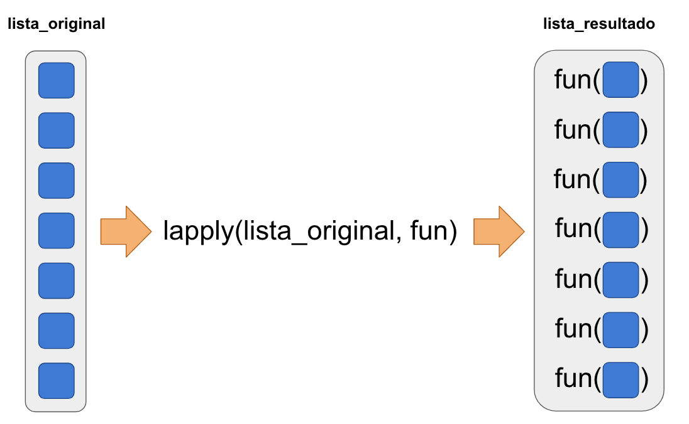

Si tenemos múltiples archivos de datos en una carpeta, todos con las mismas columnas, podemos leerlos todos y unir la data. En algunos casos, nos interesará obtener información del propio nombre del archivo.

## Versión sin problemas - Estructura de carpetas simple

Los pasos son:

1. Obtener la dirección de los archivos
2. Para cada archivo
    1. Leer los datos
    2. (Opcional) Agregar la dirección del archivo a los datos
3. Unir todos los archivos

A partir del punto 2, hay 4 maneras de hacerlo:

1. La **incorrecta**
2. La **tradicional**
3. La **moderna básica**
4. La **moderna avanzada**

```{r setup, echo=FALSE}
knitr::opts_knit$set(root.dir = rprojroot::find_rstudio_root_file())
```

### Obtener la dirección de los archivos
```{r}
files <- list.files('data/simple_data', full.names = TRUE)
files
```

### Método incorrecto

Lo incorrecto de esta forma es el uso del `for`. Este error lo cometen usualmente las personas que aprendieron a programar con otro lenguaje. El problema es que los bucles `for` en R no son nada eficientes

```{r}
# Paso 2
sales_list <- list()

for(file in files) {
  store_sales <- read.csv(file, as.is = TRUE)
  store_sales$file <- file
  sales_list <- c(sales_list, list(store_sales))
}

# Paso 3
sales <- do.call(rbind, sales_list)

head(sales)
```

**Nota:** La manera **súper incorrecta** sería hacer usar `for(i in 1:length(files))` y luego usar `files[i]`.

### Método tradicional
En lugar de usar `for`, vamos a usar `lapply`. El valor que retorna `lapply` es una lista, resultado de aplicar una función a cada elemento de un vector o lista.

#

```{r}
# Paso 2
sales_list <- lapply(files, function(file) {
  store_sales <- read.csv(file, as.is = TRUE)
  store_sales$file <- file
  store_sales
})

# Paso 3
sales <- do.call(rbind, sales_list)

head(sales)
```

### Método moderno básico
En este método la diferencia es utilizamos algunos paquetes del `tidyverse`:

1. Usamos `readr::read_csv` en lugar de `read.csv` con `as.is = TRUE`
2. Usamos `dplyr::mutate` en lugar de `sales$file <- file`
3. Usamos `dplyr::bind_rows` en lugar de la mezcla de `do.call` y `rbind`

```{r, warning=FALSE, message=FALSE}
library(dplyr)
library(readr)

# Paso 2
sales_list <- lapply(files, function(file) {
  store_sales <- read_csv(file)
  store_sales <- store_sales %>% mutate(file = file)
})

# Paso 3
sales <- bind_rows(sales_list)

sales
```

### Método moderno avanzado
En este método, usamos `purrr:map_df` en lugar de la combinación `lapply` y `dplyr::bind_rows`. De esta forma, los pasos 2 y 3 se ejecutan en conjunto. La función `map_df` hace exactamente el mismo trabajo que `lapply`, con la diferencia de que R sabe que el resultado de la función que apliquemos a los elementos de la lista original va a retornar un `data.frame`, y una vez que tiene la lista de `data.frame`s, los combina en uno sólo usando `dplyr::bind_rows` por nosotros.

```{r, warning=FALSE, message=FALSE}
library(dplyr)
library(purrr)
library(readr)

# Pasos 2 y 3
sales <- map_dfr(files, function(file) {
  store_sales <- read_csv(file)
  store_sales <- store_sales %>% mutate(file = file)
})

sales
```

Una forma más elegante aún es comenzar con un `data.frame` que tenga la columna `file`, crear una columna cuyos elementos sean `data.frame`s y usar `tidyr::unnest`.

```{r, warning=FALSE, message=FALSE}
library(dplyr)
library(readr)
library(purrr)
library(tidyr)

read_csv_folder <- function(.folder = '.', .pattern = '\\.csv$', .add_file_column = TRUE) {
  files <- list.files('data/simple_data', full.names = TRUE)
  
  df <- data_frame(file = files) %>% 
    mutate(sales = map(file, read_csv)) %>% 
    unnest(sales)
  
  return(df)
}

sales <- read_csv_folder('data/simple_data')
sales
```

Si no es necesario agregar la dirección del archivo a la data, podemos hacer todo en una sóla llamada.

```{r, warning=FALSE, message=FALSE}
library(purrr)
library(readr)

# Pasos 2 y 3
sales <- map_df(files, read_csv)

sales
```

## Versión sin problemas - Estructura de carpetas anidadas
Ya que aprendimos a hacer esto como los profesionales, vamos a usar sólo ese método. En este caso, lo que cambiará es el paso de obtener la lista de direcciones de los archivos.

```{r}
library(purrr)

folders <- list.dirs('data/complex_data', full.names = TRUE, recursive = TRUE)
files_list <- map(folders, list.files, pattern = '\\.csv$', full.names = TRUE)
files <- flatten_chr(files_list)
files
```

```{r, warning=FALSE, message=FALSE}
library(dplyr)
library(readr)
library(purrr)
library(tidyr)

read_csv_folder <- function(.folder = '.', pattern = '\\.csv$', .add_file_column = TRUE, full.names = TRUE, recursive = TRUE, ...) {
  files <- list.dirs(.folder, full.names = full.names, recursive = recursive) %>% 
    map(list.files, pattern = pattern, full.names = full.names, ...) %>% 
    flatten_chr()
  
  df <- data_frame(file = files) %>% 
    mutate(sales = map(file, read_csv)) %>% 
    unnest(sales)
  
  return(df)
}

sales <- read_csv_folder('data/complex_data')
sales
```

## Versión con problemas

### Potenciales errores o fuentes de problemas

1. No están instalados los paquetes del `tidyverse`
2. Los archivos no tienen las mismas columnas
3. Los tipos de datos no coinciden en los distintos archivos
4. Olvidar el argumento `as.is = TRUE` o `stringsAsFactors = FALSE`
5. R infiere mal el tipo de datos de alguna columna
6. El encoding del archivo es el incorrecto
7. Cuando un campo es nulo, en lugar de estar vacío tiene alguna cadena como 'NULL' o 'N/A'
8. En la carpeta hay otros archivos

